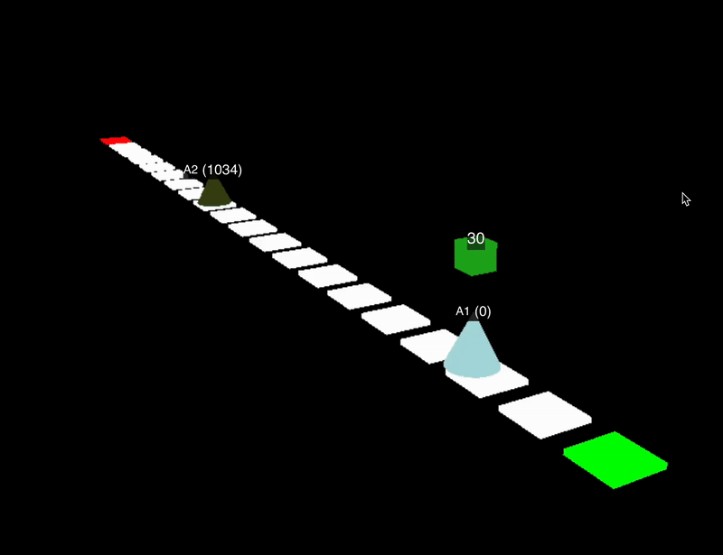

<p align='center'>
    <h1 align="center">Autonomous Software Agents Project</h1>
    <div align="center">
        
        
        
    </div>
    <p align='center'>
    This project was developed for the Autonomous Software Agents course at the University of Trento during the 2024/2025 academic year.<br/><br/>
    by<br/>
    Fabio Missagia<br/>
    Alessandro Sartore<br/>
    </p>   
</p>

The goal is to implement an autonomous agent using the **Belief-Desire-Intention (BDI)** model, which allows the agent to perceive the environment, form goals, plan actions, and continuously adapt to dynamic conditions.

The agents operate in a simulated game environment where they must **pick up and deliver parcels efficiently**, as shown in the examples below.

In addition, the project consists of two parts:

* **Single Agent**: A standalone agent that independently explores the environment, updates its beliefs, and makes decisions to fulfill its goals.

    

* **Multi-Agent**: A system of **two cooperating agents** that share information, coordinate strategies, and divide tasks to complete deliveries more effectively.

    

Performance is evaluated across multiple game levels. Results and insights are included in the [report](docs/report.pdf) under the *Evaluation and Results* section.

The environment is based on the [Deliveroo.js](https://github.com/unitn-ASA/DeliverooAgent.js) simulation framework.

## 🗂️ Project Structure
Here's a description of the project structure.

```
.
├── README.md
├── config.js
├── main.js
├── package.json
├── package-lock.json
├── yalc.lock
├── update.sh
├── docs/
│   ├── report.pdf             # Formal report
│   └── presentation.pdf       # Project presentation slides
└── src/
    ├── agent.js               # Agent initialization and lifecycle
    ├── beliefs/
    │   └── beliefs.js         # Stores the agent's perceived entities
    ├── desires/
    │   └── desires.js         # Goal representation
    ├── plans/
    │   ├── PDDLplan.js        # PDDL planner integration
    │   ├── delivero-domain.pddl # PDDL domain definition
    │   └── pathfinder.js      # Pathfinding logic
    ├── coordination/          # Multi-agent coordination
    │   ├── area_manager.js         # Manages area division between agents
    │   ├── communication_handler.js # Handshake initiator for agent communication
    │   └── handover_coordinator.js  # Coordinates roles in corridor-like maps
    ├── strategies/            # Agent decision-making strategies
    │   ├── delivery.js             # Best strategy for parcel delivery
    │   ├── exploration_manager.js  # Best strategy for map exploration
    │   ├── parcel_selector.js      # Best strategy for selecting parcels
    │   └── planner.js              # Core of the agent logic
    └── utils/
        ├── message.js         # Defines the message structure for communication
        └── utils.js           # Contains constants, thresholds, and helpers
```

## 🚀 Installation & Usage

To try the autonomous agents, follow these steps:

1. **Clone the repository**:

   ```bash
   git clone https://github.com/Sartor02/Autonomous_Software_Agents.git
   ```

2. **Navigate to the project directory**:

   ```bash
   cd Autonomous_Software_Agents
   ```

3. **Install dependencies**:

   ```bash
   npm install
   ```

4. **Start the project**:

   ```bash
   npm start
   ```

You will be prompted to choose whether to launch a **single agent** or a **multi-agent** system.

Additionally, you will be asked to provide agent tokens: make sure to paste the token corresponding to the agent(s) you created on the selected platform!

## 📚 Additional Information

If you want more information about the technical aspects, such as the communication mechanism, the exploration algorithms, or how the agent selects the best parcel, take a look to the [presentation slides](docs/presentation.pdf)! For a formal write-up, see the [final report](docs/report.pdf) instead.